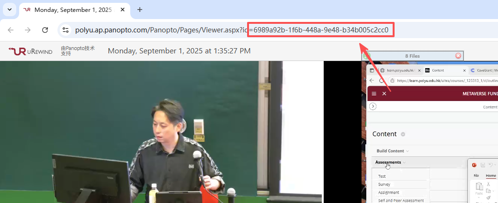

# Panopto Caption 抓取与字幕提取工具

本项目包含两个功能：

1. **从 Panopto 接口请求指定 `deliveryId` 的 JSON 数据**（保存到 `RAWJson/` 目录）
2. **从 JSON 中提取字幕（Caption）并转换为 `.txt` 文件**（保存到 `data/` 目录）

流程：**请求 → 保存原始 JSON → 格式化字幕 → 输出 txt**

---

## 📌 deliveryId 从哪里找？

在 Panopto 播放页面的 URL 中可以找到 `deliveryId`。
例如：

```
https://polyu.ap.panopto.com/Panopto/Pages/Viewer.aspx?id=6989a92b-1f6b-448a-9e48-b34b005c2cc0
```

其中：

```
id=6989a92b-1f6b-448a-9e48-b34b005c2cc0
```

就是你需要传入脚本的 `deliveryId`。

下面示例图展示它的位置：



---

## 📁 项目结构说明

```
.
├── save_panopto.py   # 脚本1：发送 POST 请求，获取 JSON 并保存到 RAWJson/
├── Caption.py        # 脚本2：从 RAWJson/ 中提取字幕 Caption 输出为 txt
├── RAWJson/          # 输入目录：存放 Panopto 返回的原始 JSON 文件
└── data/             # 输出目录：生成的 txt 字幕文件
```

---

## 🧩 1. save_panopto.py —— Panopto JSON 请求脚本

### 功能说明

向 Panopto 接口发送 form-data，字段如下：

| 字段           | 值       |
| ------------ | ------- |
| deliveryId   | 启动脚本时传入 |
| getCaptions  | true    |
| language     | 0       |
| responseType | json    |

返回 JSON 将保存为：

```
RAWJson/<deliveryId>.json
```

---

### 使用方法

#### 1）安装依赖

```bash
pip install requests
```

#### 2）运行脚本

```bash
python save_panopto.py <deliveryId>
```

示例：

```bash
python save_panopto.py 6989a92b-1f6b-448a-9e48-b34b005c2cc0
```

---

## 🧩 2. Caption.py —— 字幕提取脚本

### 功能说明

* 自动遍历 `RAWJson/` 中所有 JSON 文件
* 提取 JSON 中 `"Caption"` 字段
* 输出到 `data/xxx.txt`

### 使用方法

```bash
python Caption.py
```

结果会生成：

```
data/<同名>.txt
```

---

## 📚 数据流总结（完整流程）

```
Panopto → save_panopto.py → RAWJson/xxx.json → Caption.py → data/xxx.txt
```